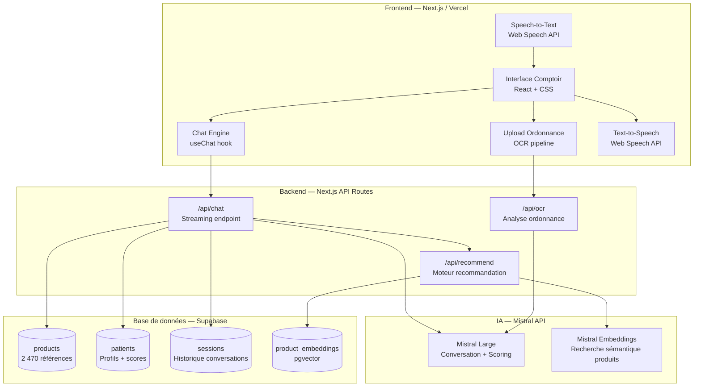
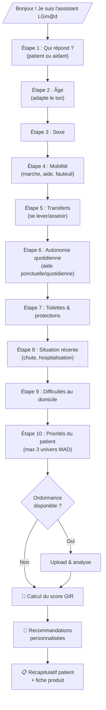
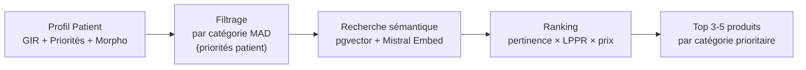

# 🏥 LGm@d — Assistant IA Conversationnel "Mode Comptoir"

## Plan de Projet Complet

---

## 1. Architecture Technique



### Stack retenue

| Couche | Technologie | Justification |
|---|---|---|
| **Frontend** | Next.js 14 (App Router) | Stack maîtrisée, SSR, API Routes intégrées |
| **Styling** | CSS vanilla + variables | Contrôle total, design premium accessible |
| **IA conversationnelle** | Mistral Large (API) | Crédits disponibles, performant en français |
| **Embeddings / RAG** | Mistral Embed + pgvector | Recherche sémantique dans le catalogue |
| **OCR ordonnance** | Mistral vision (pixtral) | Analyse d'images directement via l'API |
| **TTS / STT** | Web Speech API native | Gratuit, pas de dépendance externe |
| **BDD** | Supabase (PostgreSQL + pgvector) | Déjà utilisé, RLS, temps réel |
| **Hébergement** | Vercel | Déploiement simple, edge functions |

---

## 2. Étapes de Développement (MVP First)

### Phase 1 — Fondations (Semaine 1)

- [ ] **Setup projet** Next.js + Supabase + structure dossiers
- [ ] **Migration CSV → Supabase** : import des 2 470 produits dans une table `products`
- [ ] **Catégorisation automatique** des produits (le champ `categorie` est vide) : classification par analyse du `nom` + `description` via Mistral en batch → mapping vers les 6 univers MAD (Marche, Chambre, Fauteuils, Salle de bain, Toilettes, Aides techniques)
- [ ] **Génération embeddings** : vectoriser `nom + description + points_forts` de chaque produit via Mistral Embed → stocker dans pgvector

### Phase 2 — Chat Engine (Semaine 2)

- [ ] **API Route `/api/chat`** avec streaming (Vercel AI SDK + Mistral)
- [ ] **System prompt métier** : rôle pharmacien-conseil, grille GIR, flux conversationnel
- [ ] **Interface Chat** : composant React avec bulles, input, boutons rapides
- [ ] **Logique d'entretien structuré** : l'IA suit les 9 étapes du questionnaire de manière naturelle
- [ ] **Scoring GIR dynamique** en temps réel à chaque réponse

### Phase 3 — Recommandation Produit (Semaine 3)

- [ ] **Moteur de recommandation** : à partir du profil patient (GIR + priorités + situation), requête sémantique pgvector filtrée par catégorie
- [ ] **Affichage produits** : cartes produit avec image, nom, prix, description, LPPR
- [ ] **Personnalisation** : pondération par poids/taille patient, pathologie, priorités sélectionnées

### Phase 4 — Ordonnance & Multimodal (Semaine 4)

- [ ] **Upload ordonnance** (drag & drop / photo)
- [ ] **Analyse via Mistral Vision** (Pixtral) : extraction médicaments, pathologies, dispositifs médicaux prescrits
- [ ] **Intégration au profil patient** : les infos ordonnance enrichissent le scoring et les recommandations
- [ ] **TTS** : lecture vocale des réponses de l'IA (Web Speech API)
- [ ] **STT** : dictée vocale pour les patients (Web Speech API)

### Phase 5 — Polish & Démo (Semaine 5)

- [ ] **Cas démo pré-configurés** (voir section 6)
- [ ] **Mode démo** : bouton pour charger un persona patient instantanément
- [ ] **Dashboard récap** : résumé patient, GIR, produits recommandés (vue pharmacien)
- [ ] **Design premium** : animations, transitions, branding LGm@d
- [ ] **Consentement RGPD** : écran d'acceptation avant collecte

---

## 3. Design du Flux Conversationnel

Le flux suit le questionnaire existant mais de manière **naturelle et empathique** :



### Principes du flux conversationnel

| Principe | Détail |
|---|---|
| **Ton** | Chaleureux, respectueux, professionnel. Vouvoiement. Adapté si aidant vs patient. |
| **Progression** | Une question à la fois. Proposer des choix rapides (boutons) + possibilité de répondre en texte libre. |
| **Flexibilité** | L'IA peut reformuler, demander des précisions, gérer les hors-sujets avec bienveillance. |
| **Transparence** | Expliquer pourquoi chaque question est posée ("cette information nous aide à…"). |
| **Durée cible** | 3-5 minutes pour l'entretien complet (10 questions + reco). |

---

## 4. Logique de Scoring — 6 Niveaux GIR

Le scoring s'inspire de la grille AGGIR officielle, **simplifiée et adaptée** au contexte MAD en pharmacie.

### Variables évaluées (mappées depuis le questionnaire)

| Variable AGGIR | Question du questionnaire | Scoring |
|---|---|---|
| **Déplacements intérieurs** | Q4 — Mobilité | A=0 / B=1 / C=2 / D=3 |
| **Transferts** | Q5 — Se lever/s'asseoir | A=0 / B=1 / C=2 |
| **Toilette** | Q7 — Toilettes & protections | A=0 / B=1 / C=2 / D=3 |
| **Autonomie globale** | Q6 — Autonomie vie quotidienne | A=0 / B=1 / C=2 |
| **Événement aggravant** | Q8 — Situation récente | 0 / +1 / +2 / +3 |
| **Environnement** | Q9 — Difficultés domicile | 0 / +1 / +2 |

### Grille de classification

| Score total | GIR | Description | Profil type |
|---|---|---|---|
| 0-2 | **GIR 6** | Autonome | Prévention, confort |
| 3-5 | **GIR 5** | Légèrement dépendant | Aide ponctuelle marche/bain |
| 6-8 | **GIR 4** | Moyennement dépendant | Aide quotidienne, aménagement |
| 9-11 | **GIR 3** | Modérément dépendant | Aide pluriquotidienne, matériel adapté |
| 12-14 | **GIR 2** | Fortement dépendant | Prise en charge lourde |
| 15+ | **GIR 1** | Dépendance totale | Matériel médicalisé complet |

> [!IMPORTANT]
> Le scoring est indicatif et ne remplace pas une évaluation GIR officielle par un professionnel mandaté. Il sert de **guide de recommandation produit** pour le pharmacien.

### Implémentation

L'IA Mistral calcule le score en temps réel via un **function calling** structuré :
- À chaque réponse patient → mise à jour du JSON de profil
- Le score GIR est réévalué dynamiquement
- L'IA a la latitude d'ajuster le score ±1 si le contexte conversationnel le justifie (ex: patient minimisant ses difficultés)

---

## 5. Moteur de Recommandation

### Architecture du matching Profil → Produits



### Étapes détaillées

1. **Catégorisation catalogue** (pré-traitement initial)
   - Classifier les 2 470 produits en 6 univers MAD + sous-catégories
   - Champs utilisés : `nom`, `description`, `code_lppr`
   - Méthode : prompt batch Mistral + validation manuelle

2. **Filtrage par profil**
   - GIR → définit la gamme de prix et le niveau de technicité
   - Priorités patient → sélectionne les univers MAD pertinents
   - Morphologie (poids/taille) → filtre les spécifications produit

3. **Recherche sémantique**
   - Query = description textuelle du besoin patient (générée par l'IA)
   - Similitude cosinus sur embeddings produits (pgvector)
   - Top-K = 10-15 candidats par catégorie

4. **Ranking final**
   - Score = `0.5 × pertinence_sémantique + 0.3 × couverture_LPPR + 0.2 × rapport_qualité_prix`
   - Bonus si le produit a un champ `recommande` rempli
   - Présentation : Top 3 produits par catégorie prioritaire avec justification

### Matrice GIR → Catégories Produits

| GIR | Univers prioritaires | Exemples produits |
|---|---|---|
| **6** | Prévention, confort | Cannes de marche, tapis antidérapant |
| **5** | Aide marche, salle de bain | Rollators, barres d'appui, sièges de douche |
| **4** | Chambre, transferts, toilettes | Lit médicalisé, lève-personne, réhausseur WC |
| **3** | Fauteuils, anti-escarres, aides techniques | Fauteuil roulant, matelas anti-escarres, couverts adaptés |
| **2** | Équipement complet | Lit médicalisé + matelas air, fauteuil coquille, protections |
| **1** | Package médicalisé intégral | Ensemble chambre médicalisée, lève-personne, matelas air, protections continues |

---

## 6. Cas Démo pour le Pitch

### 6 personas couvrant tous les niveaux GIR

| # | Persona | Âge | GIR | Scénario | Produits attendus |
|---|---|---|---|---|---|
| 1 | **Marie** | 65 ans | **6** | Active, légère arthrose genou. Veut prévenir les chutes. | Canne pliante, tapis antidérapant bain |
| 2 | **Jean** | 74 ans | **5** | Essoufflement à la marche, vit seul. Difficulté dans la baignoire. | Rollator 4 roues, siège de douche, barre d'appui |
| 3 | **Françoise** | 78 ans | **4** | Retour d'hospitalisation (col du fémur). Aidant : sa fille. | Déambulateur, réhausseur WC, lit médicalisé location |
| 4 | **Robert** | 82 ans | **3** | Parkinson stade modéré. Chutes fréquentes. Protections jour. | Fauteuil roulant, matelas anti-escarres, protections TENA |
| 5 | **Simone** | 86 ans | **2** | AVC récent, hémiplégie gauche. Alitée la plupart du temps. | Lit médicalisé, matelas air, lève-personne, fauteuil coquille |
| 6 | **André** | 90 ans | **1** | Démence avancée, grabataire. Aidant : fils. Ordonnance complète. | Package complet : lit air, lève-personne, protections, fauteuil coquille, cousin anti-escarres |

> [!TIP]
> **Le cas n°6 (André)** est idéal pour démontrer l'analyse d'ordonnance : on charge une ordonnance fictive avec médicaments + prescriptions de dispositifs médicaux.

### Mode démo dans l'interface

- Bouton "Charger un cas démo" dans le header
- Sélection du persona → pré-remplit les réponses au questionnaire
- L'IA déroule l'entretien automatiquement en 30 secondes
- Résultat : GIR + recommandations → impression immédiate sur le décideur

---

## 7. Risques et Points de Vigilance

### ⚕️ Médical

| Risque | Mitigation |
|---|---|
| L'IA donne un "diagnostic" | Disclaimer permanent : "outil d'aide à la recommandation, ne remplace pas un avis médical" |
| Score GIR erroné | Le pharmacien valide toujours le résultat. Bouton "Ajuster le GIR" |
| Recommandation inadaptée | Revue humaine obligatoire avant commande. L'IA explique son raisonnement |

### 🔒 RGPD / Données de santé

| Risque | Mitigation |
|---|---|
| Données sensibles stockées | Consentement explicite avant collecte. Politique de rétention (ex: 12 mois) |
| Transit données vers Mistral API | Données anonymisées avant envoi (pas de nom/prénom dans les prompts) |
| Pas d'hébergement HDS | Acceptable pour un POC. Mentionner dans la roadmap prod |

### 🎨 UX

| Risque | Mitigation |
|---|---|
| Entretien trop long | Timer visuel. Max 10 questions. Boutons de réponse rapide |
| Patient senior intimidé par l'IA | Ton chaleureux. Option voix. Interface grande police. Design simple et rassurant |
| Hallucinations produit | RAG strict : l'IA ne recommande QUE des produits du catalogue Supabase |

---

## 8. Structure du Projet

```
Agent IA/
├── app/
│   ├── layout.tsx              # Layout global + fonts
│   ├── page.tsx                # Landing / sélection mode
│   ├── comptoir/
│   │   └── page.tsx            # Interface conversationnelle principale
│   ├── api/
│   │   ├── chat/route.ts       # Streaming chat Mistral
│   │   ├── ocr/route.ts        # Analyse ordonnance
│   │   └── recommend/route.ts  # Moteur recommandation
│   └── demo/
│       └── page.tsx            # Mode démo avec personas
├── components/
│   ├── Chat/
│   │   ├── ChatWindow.tsx      # Zone de conversation
│   │   ├── MessageBubble.tsx   # Bulle de message
│   │   ├── QuickActions.tsx    # Boutons réponse rapide
│   │   └── VoiceControls.tsx   # TTS/STT
│   ├── Patient/
│   │   ├── PatientSummary.tsx  # Récap profil patient
│   │   ├── GIRBadge.tsx        # Badge niveau GIR
│   │   └── OrdonnanceUpload.tsx
│   ├── Products/
│   │   ├── ProductCard.tsx     # Carte produit
│   │   └── RecommendationList.tsx
│   └── Demo/
│       └── PersonaSelector.tsx
├── lib/
│   ├── mistral.ts              # Client Mistral API
│   ├── supabase.ts             # Client Supabase
│   ├── scoring.ts              # Logique scoring GIR
│   ├── prompts.ts              # System prompts
│   └── types.ts                # Types TypeScript
├── scripts/
│   ├── import-catalog.ts       # Import CSV → Supabase
│   └── generate-embeddings.ts  # Génération embeddings
└── public/
    └── assets/                 # Logo LGm@d, icônes
```

---

## Verification Plan

### Tests automatisés
- **Scoring GIR** : tests unitaires sur `lib/scoring.ts` avec les 6 cas démo → vérifier que chaque persona est classé au bon GIR
- **API Chat** : test d'intégration de `/api/chat` → vérifier que le streaming fonctionne et que l'IA suit le flux conversationnel
- **Import catalogue** : vérifier que les 2 470 produits sont importés sans perte dans Supabase

### Tests navigateur (browser subagent)
- Charger l'interface Comptoir → vérifier le rendu et la responsivité
- Envoyer un message → vérifier la réponse en streaming
- Tester chaque cas démo → vérifier GIR + recommandations cohérentes
- Uploader une ordonnance image → vérifier l'extraction OCR

### Vérification manuelle
- L'utilisateur teste les 6 personas démo en conditions réelles
- Validation de la pertinence des recommandations produits par un expert MAD
- Test sur tablette tactile (simulation pharmacie)
